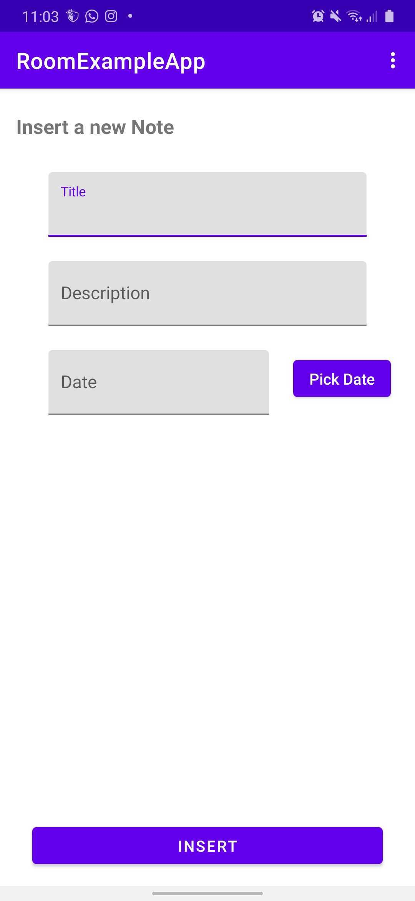
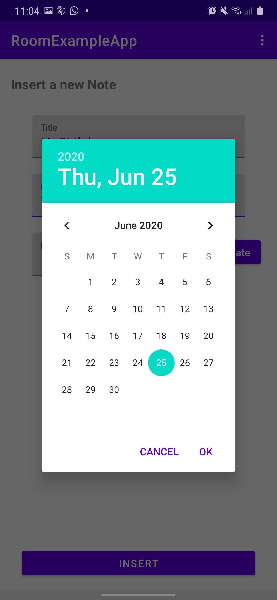

# Room-Example
A simple Android Application with Room and Unit testing.

### Build with 📋

* Kotlin
* View Bindings
* Coroutines
* MVVM
* Dependency Injection with Koin
* Navigation Component
* Roboelectric

## Screenshots

 
 

## Autor ✒️
* **Yonatan Ulises Segura** - *Android Developer* - [Yonatan Segura](https://github.com/YonatanSegura97)

---
⌨️ with ❤️ by [Yonatan Segura](https://github.com/YonatanSegura97)😁
